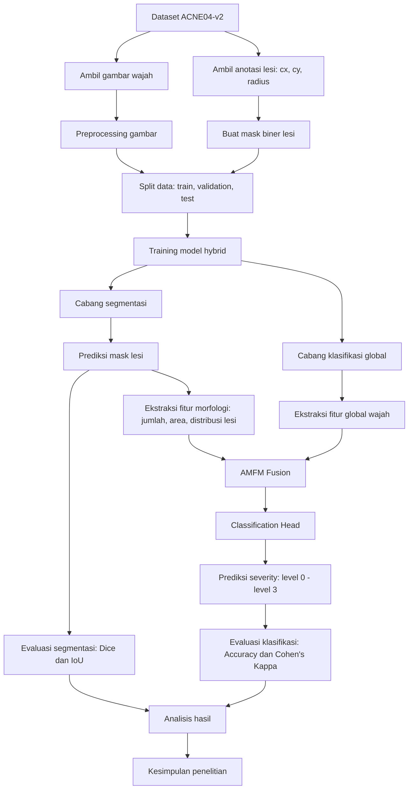
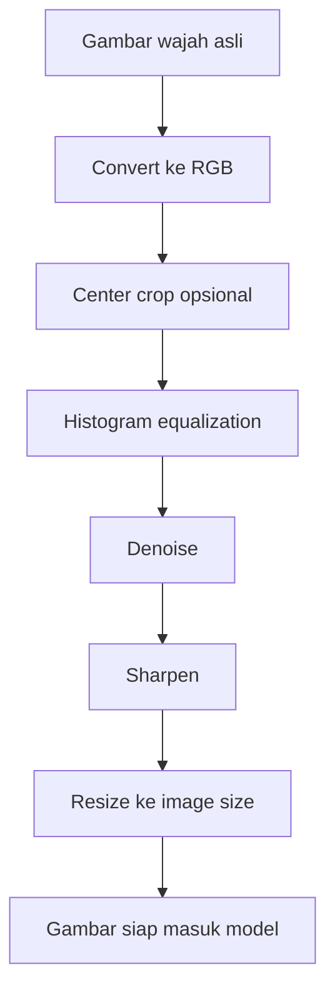
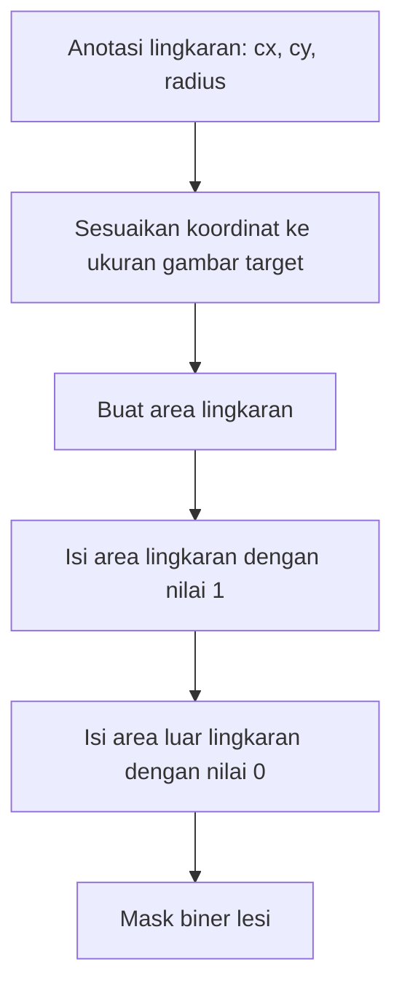
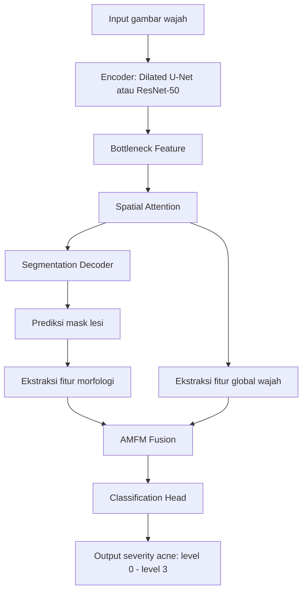
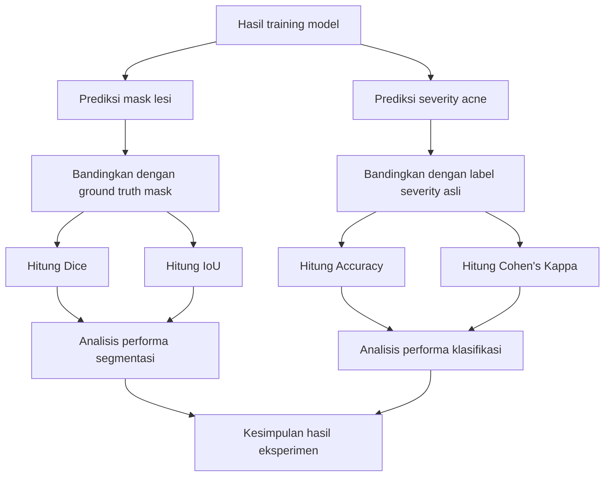
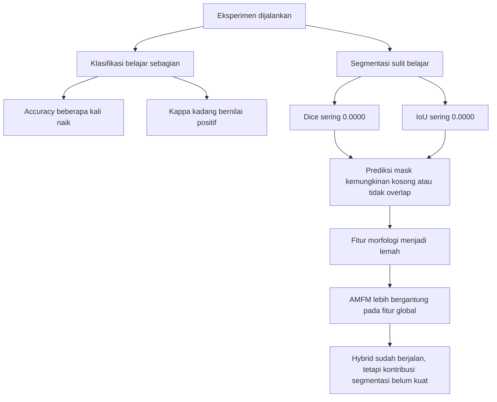
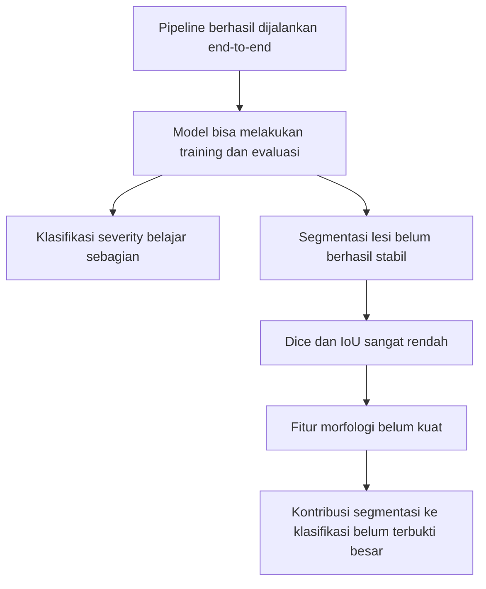

# Flow Chart Sederhana Hasil Penelitian

Dokumen ini menjelaskan alur penelitian segmentasi dan klasifikasi acne secara sederhana, tetapi tetap detail. Fokus utama penelitian ini adalah menguji model hybrid yang menggabungkan segmentasi lesi jerawat dan klasifikasi tingkat keparahan acne.

---

## 1. Flow Besar Penelitian



---

## 2. Penjelasan Flow Besar

Penelitian dimulai dari dataset `ACNE04-v2`. Dataset ini berisi dua informasi utama:

- gambar wajah pasien acne
- anotasi lesi jerawat berbentuk lingkaran

Anotasi lesi terdiri dari:

```text
cx     = posisi tengah lesi pada sumbu x
cy     = posisi tengah lesi pada sumbu y
radius = ukuran lingkaran lesi
```

Dari anotasi tersebut, dibuat mask segmentasi biner:

```text
0 = background
1 = area lesi jerawat
```

Setelah gambar dan mask siap, data dibagi menjadi:

```text
train set
validation set
test set
```

Data train digunakan untuk melatih model, data validation digunakan untuk memantau performa selama training, dan data test digunakan untuk mengevaluasi hasil akhir model.

---

## 3. Flow Preprocessing Gambar



Preprocessing dilakukan agar gambar lebih siap dipelajari oleh model. Tahap ini membantu menormalkan input, memperjelas tekstur, dan menyesuaikan ukuran gambar dengan kebutuhan model.

Pada eksperimen ini, preprocessing dilakukan secara `on-the-fly` saat training.

---

## 4. Flow Pembuatan Mask Segmentasi



Mask ini menjadi target pembelajaran untuk cabang segmentasi. Artinya, model dilatih agar bisa menghasilkan mask prediksi yang mirip dengan mask ground truth.

---

## 5. Flow Model Hybrid



Model disebut hybrid karena menggabungkan dua jenis informasi:

| Komponen | Fungsi |
|---|---|
| Cabang segmentasi | Memprediksi area lesi jerawat |
| Fitur morfologi | Mengambil informasi jumlah, area, dan distribusi lesi |
| Fitur global wajah | Mengambil informasi kondisi wajah secara keseluruhan |
| AMFM Fusion | Menggabungkan fitur morfologi dan fitur global |
| Classification Head | Menentukan tingkat severity acne |

Secara konsep, model diharapkan tidak hanya melihat wajah secara umum, tetapi juga memperhatikan lokasi dan bentuk lesi jerawat.

---

## 6. Flow Evaluasi



Metrik yang digunakan:

| Metrik | Digunakan untuk | Makna sederhana |
|---|---|---|
| Dice | Segmentasi | Mengukur kemiripan mask prediksi dengan mask asli |
| IoU | Segmentasi | Mengukur area overlap antara mask prediksi dan mask asli |
| Accuracy | Klasifikasi | Mengukur persentase prediksi severity yang benar |
| Cohen's Kappa | Klasifikasi | Mengukur kesepakatan prediksi dengan label asli dengan mempertimbangkan peluang tebak acak |

---

## 7. Flow Hasil Penelitian



Hasil eksperimen menunjukkan pola utama:

```text
Klasifikasi: masih bisa belajar sebagian
Segmentasi : belum stabil dan sering gagal
Hybrid     : sudah terbentuk, tetapi belum optimal
```

Klasifikasi masih bisa belajar karena model dapat memanfaatkan fitur global wajah. Namun, segmentasi sulit belajar karena area lesi sangat kecil dibanding background. Akibatnya, model cenderung memprediksi background atau mask kosong.

---

## 8. Interpretasi Hasil

Secara sederhana, hasil penelitian dapat dibaca seperti ini:



Artinya, masalah utama penelitian saat ini bukan pada pipeline kode dasar. Pipeline sudah berjalan dari preprocessing, training, evaluasi, sampai penyimpanan hasil.

Masalah utama ada pada perilaku belajar model, khususnya cabang segmentasi.

---

## 9. Dugaan Penyebab Segmentasi Gagal

Beberapa penyebab yang paling mungkin:

1. Lesi jerawat terlalu kecil dibanding ukuran wajah.
2. Piksel background jauh lebih banyak daripada piksel lesi.
3. Model cenderung memilih solusi aman dengan memprediksi background.
4. Anotasi lingkaran mungkin kurang sesuai dengan bentuk asli lesi.
5. Cabang klasifikasi lebih mudah belajar dibanding cabang segmentasi.
6. Data eksperimen masih relatif terbatas untuk tugas segmentasi piksel-level.

---

## 10. Kesimpulan Sederhana

Kesimpulan utama penelitian:

```text
Model hybrid berhasil dibuat dan dijalankan.
Cabang klasifikasi mampu belajar sebagian.
Cabang segmentasi belum stabil.
Dice dan IoU yang sering nol menunjukkan model belum berhasil mempelajari mask lesi.
Karena segmentasi lemah, fitur morfologi belum memberi kontribusi besar.
```

Dengan demikian, hasil penelitian saat ini lebih tepat disebut sebagai:

```text
Proof-of-concept pipeline hybrid segmentasi dan klasifikasi acne yang berhasil berjalan,
tetapi cabang segmentasi masih perlu diperbaiki agar benar-benar membantu klasifikasi severity.
```

